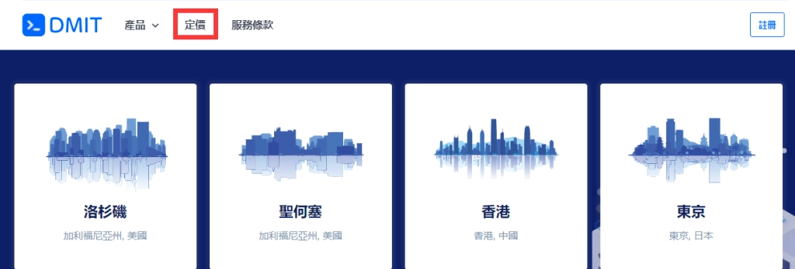

# DMIT香港CN2 GIA大带宽VPS：稳定高性能，限时特惠不容错过

---

如果你正在找一台能应对高峰流量、访问速度快、网络稳定的香港VPS，那这篇文章可能正好适合你。DMIT最近推出的香港CN2 GIA特惠套餐，配备1-10Gbps大带宽、三网回程直连优化线路，无论是跑电商平台、搭建企业官网，还是做多节点内容分发，都能hold住。接下来我们就聊聊这个套餐到底怎么样，值不值得入手。

---

## DMIT是谁?为什么选它?

DMIT.io从2018年开始做VPS和裸金属服务器，主要面向全球用户。他们家最大的特点就是网络线路扎实——香港CN2 GIA、美国CN2 GIA、日本CN2 GIA都有覆盖，而且带宽选择从1Gbps到10Gbps不等。支付方式也挺友好，支付宝、PayPal、信用卡都能用，国内用户买起来没什么门槛。

## 这次的香港特惠套餐有什么亮点?

这次推出的专属套餐叫"HKG.Pro.TsuenWan"，机房在香港荃湾，三网回程都走CN2 GIA。具体来说：
- **电信去程**：CN2 GIA
- **联通去程**：CUG
- **移动去程**：CMI

这种配置意味着什么？简单说，就是你从国内访问这台服务器时，延迟低、丢包少、高峰期也不卡。对于需要稳定连接的业务场景——比如在线客服系统、视频会议、实时数据同步——这种线路质量能省不少心。

如果你还在犹豫要不要上车，👉 [看看DMIT香港CN2 GIA的实际表现，现在下单还有限时优惠](https://www.dmit.io/aff.php?aff=13832)，错过就得等下次了。

## 除了特惠套餐，常规方案怎么样?

DMIT的常规香港CN2 GIA系列也值得关注，现在全部升级到了1Gbps端口。这些配置涵盖了从小规模测试到大流量业务的各种需求：

**适用场景举例：**
- **小型电商或企业官网**：选基础配置就够了，成本可控，速度也不慢
- **多节点内容分发**：中高配版本能扛住更大并发量
- **大流量测试或数据密集型应用**：10Gbps带宽版本直接拉满

无论你是刚起步的个人站长，还是需要多地部署的技术团队，DMIT的香港CN2 GIA线路都能把国内访问延迟压到很低水平，高峰期流量依然稳定畅通。

## 实际使用体验怎么样?

从用户反馈来看，DMIT香港VPS的口碑主要集中在这几点：
- **速度确实快**：CN2 GIA直连，ping值基本在30-50ms左右（取决于你的地理位置）
- **稳定性靠谱**：高峰时段不掉链子，丢包率控制得很好
- **带宽给力**：1Gbps起步，跑大文件传输或视频流媒体都不费劲

当然也有需要注意的地方：价格相比普通线路VPS肯定要高一些，但你要是真的在乎网络质量和用户体验，这点溢价其实挺值的。毕竟服务器卡顿、掉线带来的损失，可能远超你省下的那点钱。

## 适合谁用?

说实话，DMIT香港CN2 GIA VPS并不适合所有人。如果你只是想挂个小博客、做做测试，用普通VPS就够了。但如果你遇到以下情况，那这套方案会是个不错的选择：

- 你的业务主要面向国内用户，对访问速度和稳定性有明确要求
- 你需要处理大流量或高并发场景（电商促销、直播推流等）
- 你在做多地部署，需要一个靠谱的香港节点
- 你受够了普通VPS在高峰期的卡顿和丢包

## 怎么买最划算?

如果你决定试试DMIT的香港VPS，建议先从年付套餐入手——一般会有折扣，而且省去了频繁续费的麻烦。支付方式选支付宝最方便，几分钟就能开通。

另外，DMIT支持多种配置灵活组合，你可以根据实际需求选择带宽和流量包。如果不确定要选哪个档位，可以从基础版开始试用，后期觉得不够用再升级也不迟。

---

## 总结一下

DMIT香港CN2 GIA VPS的核心优势就是**稳定+快速+大带宽**，特别适合对网络质量有要求的国内业务场景。这次的限时特惠套餐性价比不错，如果你正好需要一台香港服务器，现在入手时机挺合适。

为什么推荐DMIT？因为它在香港VPS市场里确实做到了"线路扎实、性能靠谱、服务稳定"这几点，不管是建站、做分发，还是跑应用，👉 [DMIT都能给你一个省心的解决方案](https://www.dmit.io/aff.php?aff=13832)。别等需要用的时候才临时抱佛脚，提前备好一台高质量VPS，关键时刻能帮大忙。
